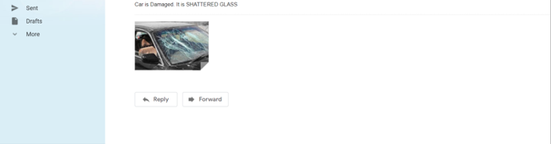

# Customer-Complaint-Classification
<h3><b>About:</b></h3>
Lodging complaints in-person may not be always possible due to enormous number of product being used on a day-to-day basis. To address this problem, built a small prototype for car insurance industry using CNN model and object detection algorithm YOLO wherein, it was able to detect the damage done to a car and accordingly assess its right to insurance. Developed a small prototype for car insurance industry using CNN model and object detection algorithm YOLO wherein, it was able to detect the damage done to a car and accordingly assess its right to insurance. 

<h3><b>Objective: </b></h3>
The objective is to build a system which can detect the snapshot of the faulty product uploaded by the consumer which will later be classified into its respective category. The steps to be followed to achieve the objective will be:

1. Train the model with different types of objects and to which class they belong.
2. By using Segmentation, image is divided into various parts called segments. By dividing the image into segments, important segments of the image can be used for processing the image. That, in a nutshell, is how image segmentation works.
3. Classification of images uploaded by the consumer into their specific category.

<h3><b>Approach: </b></h3>
Object Training, Object Identification & Damage Detection : 

1. Importing specified modules
2. Define options to build the model. We are using CNN model.
3. Collecting the data
4. Annotating the data
5. Training the model (1000-1200 Images Per Class)
6. Validating the model
7. Run the model on images
8. Make predictions

Alert through Mail:
1. Import required libraries for smtp protocol
2. Create server connection with Gmail by respective port no.
3. Provide login details of sender
4. Provide details of sender and receiver along with the message to be passed
5. Terminate the connection

<h3><b>Output: </b></h3>

<h3><b>Dataset Used: https://www.kaggle.com/anujms/car-damage-detection</b></h3>

<h3><b>Future Scope: </b></h3>
Further after detection and masking of car damage, the process can help the car evaluators/insurance claim settlement personnel in quantifying the damage severity, in terms of dimensions and approximate relative area (w.r.t. the car surface area) of damage.

